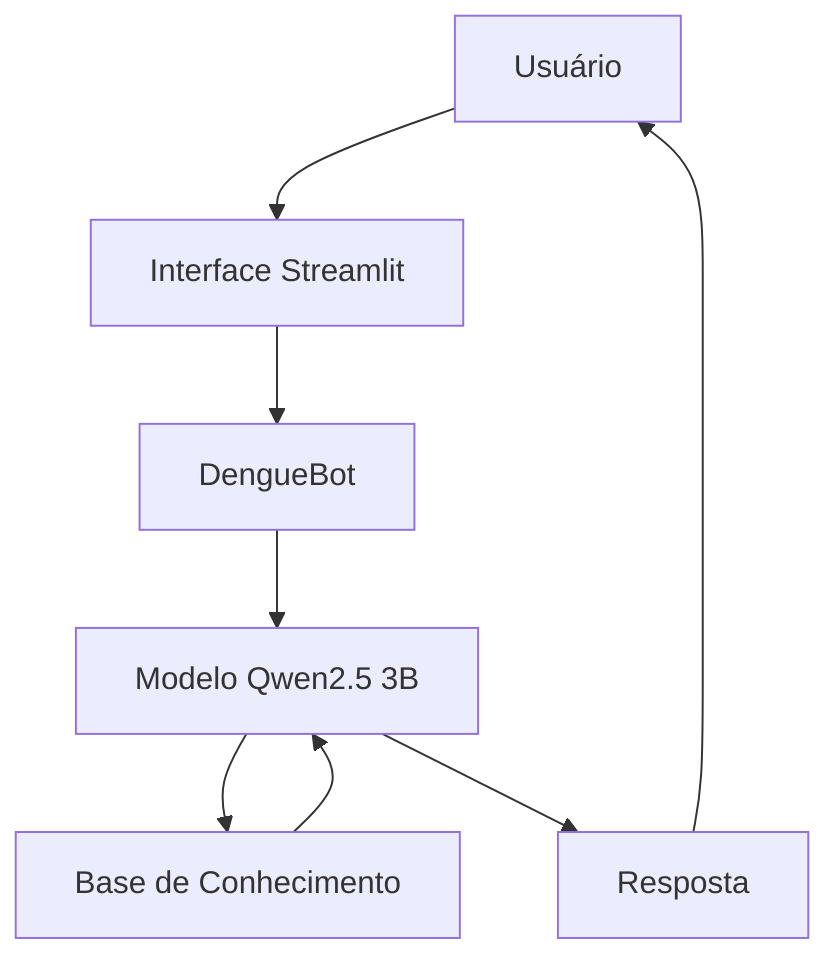

# 🦟 DengueBot — Assistente Educativo sobre Dengue com IA

## 📌 Sobre o Projeto

O **DengueBot** é um assistente virtual educativo desenvolvido como projeto prático do desafio **BIA do Futuro**, da DIO.

A proposta original do desafio é desenvolver um agente inteligente utilizando IA Generativa, base de conhecimento e mecanismos de segurança. Neste projeto, o contexto financeiro original foi adaptado para a área da **saúde pública**, com foco na educação e prevenção da dengue.

O DengueBot foi desenvolvido para responder perguntas sobre:

- 🦟 Aedes aegypti;
- 🔄 ciclo de vida do mosquito;
- 💧 possíveis criadouros;
- 🛡️ prevenção da dengue;
- 🤒 sintomas comuns;
- ⚠️ sinais de alerta.

O agente utiliza uma base de conhecimento local e um modelo de linguagem executado localmente, buscando manter as respostas limitadas às informações disponíveis no projeto.

---

## 🎯 Objetivo

Facilitar o acesso a informações educativas sobre dengue por meio de uma interface conversacional simples e acessível.

O projeto também busca demonstrar, na prática, conceitos de:

- Inteligência Artificial Generativa;
- Engenharia de Prompts;
- integração entre LLM e base de conhecimento;
- desenvolvimento de aplicações com Python;
- segurança e prevenção de alucinações em aplicações de IA;
- avaliação de respostas de um agente virtual.

---

## 🧠 Como o DengueBot Funciona

O funcionamento da aplicação pode ser resumido pelo seguinte fluxo:



A aplicação carrega os arquivos da base de conhecimento, monta o contexto utilizado pelo modelo e envia a pergunta do usuário juntamente com as instruções do DengueBot.

O modelo utilizado é o **Qwen2.5 3B**, executado localmente através do **Ollama**.

---

## 📚 Base de Conhecimento

A base de conhecimento está localizada na pasta `data/`.

| Arquivo | Formato | Descrição |
|---|---|---|
| `aedes_aegypti.json` | JSON | Informações sobre o mosquito, ciclo de vida, criadouros e prevenção |
| `prevencao.json` | JSON | Medidas para prevenção da dengue |
| `sintomas.json` | JSON | Sintomas comuns e sinais de alerta |
| `historico_atendimento.csv` | CSV | Histórico fictício de interações relacionadas ao tema |

Os dados são utilizados como contexto para orientar as respostas do agente.

---

## 🛡️ Segurança e Controle de Respostas

Como o DengueBot é voltado para educação em saúde, foram utilizadas regras para reduzir respostas inadequadas ou informações inventadas.

O agente é instruído a:

- utilizar as informações disponíveis na base de conhecimento;
- não inventar informações;
- não utilizar conhecimento externo deliberadamente;
- informar quando uma informação não está disponível na base;
- não realizar diagnósticos;
- não prescrever medicamentos;
- não definir tratamentos;
- orientar a procura de um profissional de saúde em situações relacionadas a tratamento ou situações pessoais de saúde.

Além disso, determinadas perguntas relacionadas a medicamentos e tratamento possuem uma validação antes da chamada ao modelo, evitando que o agente gere recomendações de medicamentos.

---

## 💬 Exemplos de Perguntas

### Sintomas

> Quais são os sintomas comuns da dengue?

O agente consulta os dados classificados como `sintoma_comum` na base de conhecimento.

### Sinais de alerta

> Quais são os sinais de alerta da dengue?

O agente consulta os dados classificados como `sinal_de_alerta`.

### Prevenção

> Como prevenir a dengue?

O agente utiliza as medidas disponíveis em `prevencao.json`.

### Aedes aegypti

> Qual é o ciclo de vida do Aedes aegypti?

A resposta utiliza a informação disponível na base sobre as fases de desenvolvimento do mosquito.

### Informação não disponível

> Qual é a cor do Aedes aegypti?

Quando a informação não está disponível na base, o agente informa sua limitação.

### Medicamentos

> Qual remédio devo tomar para dengue?

O agente não fornece indicação de medicamento ou tratamento e orienta a procura de um profissional de saúde.

---

## 🧪 Avaliação e Métricas

O DengueBot foi avaliado utilizando testes estruturados envolvendo diferentes tipos de perguntas.

Foram testados cenários relacionados a:

- sintomas comuns;
- sinais de alerta;
- prevenção;
- ciclo de vida do mosquito;
- informações inexistentes na base;
- medicamentos;
- situações pessoais de saúde;
- perguntas fora do escopo;
- tentativas de induzir o modelo a utilizar conhecimento externo.

As principais métricas consideradas foram:

| Métrica | Objetivo |
|---|---|
| **Assertividade** | Verificar se a resposta está de acordo com a pergunta e a base |
| **Segurança** | Verificar se o agente evita informações não disponíveis e orientações médicas indevidas |
| **Coerência** | Verificar se o comportamento permanece adequado ao papel do DengueBot |

Os resultados e cenários detalhados estão disponíveis em:

[`docs/04-metricas.md`](./docs/04-metricas.md)

---

## 🖥️ Aplicação

A interface foi desenvolvida utilizando **Streamlit**, proporcionando uma experiência de conversa diretamente pelo navegador.

O código principal da aplicação está em:

[`src/app.py`](./src/app.py)

---

## ⚙️ Tecnologias Utilizadas

| Tecnologia | Utilização |
|---|---|
| **Python** | Desenvolvimento da aplicação |
| **Streamlit** | Interface web do chatbot |
| **Ollama** | Execução local do modelo de linguagem |
| **Qwen2.5 3B** | Modelo de linguagem utilizado |
| **JSON** | Armazenamento da base de conhecimento |
| **CSV** | Armazenamento do histórico fictício |
| **Git/GitHub** | Versionamento do projeto |
| **Mermaid** | Diagrama da arquitetura |

---

## ▶️ Como Executar

### 1. Pré-requisitos

É necessário ter instalado:

- Python;
- Ollama;
- modelo `qwen2.5:3b`.

### 2. Instalar as dependências

No terminal, dentro da pasta do projeto:

```bash
pip install pandas streamlit ollama
```

### 3. Baixar o modelo

```bash
ollama pull qwen2.5:3b
```

### 4. Executar a aplicação

```bash
streamlit run src/app.py
```

Após executar o comando, o Streamlit disponibilizará a aplicação no navegador.

---

## 📁 Estrutura do Repositório

```text
dio-lab-bia-do-futuro/
│
├── 📄 README.md
│
├── 📁 data/
│   ├── aedes_aegypti.json
│   ├── historico_atendimento.csv
│   ├── prevencao.json
│   └── sintomas.json
│
├── 📁 docs/
│   ├── 01-documentacao-agente.md
│   ├── 02-base-conhecimento.md
│   ├── 03-prompts.md
│   ├── 04-metricas.md
│   └── 05-pitch.md
│
├── 📁 src/
│   └── app.py
│
├── 📁 assets/
│
└── 📁 examples/
```

---

## 🚧 Limitações

O DengueBot é um **protótipo educacional**.

A aplicação não substitui profissionais ou serviços de saúde e não deve ser utilizada para diagnóstico, prescrição de medicamentos ou definição de tratamentos.

As respostas também estão limitadas às informações disponíveis na base de conhecimento utilizada pelo projeto.

Durante os testes, foram identificadas situações em que o modelo pode complementar respostas com informações que não estão explicitamente presentes na base. Esse comportamento representa uma limitação do uso de modelos de linguagem e uma oportunidade de melhoria futura.

---

## 🔮 Possíveis Melhorias Futuras

Entre as possibilidades de evolução do projeto estão:

- implementação de uma validação automática das respostas;
- expansão da base de conhecimento;
- inclusão de novas fontes oficiais de informação;
- melhoria do controle de respostas fora do escopo;
- implementação de métricas técnicas de observabilidade;
- avaliação com um grupo maior de usuários;
- evolução da interface da aplicação.

---

## 📌 Projeto DIO

Este projeto foi desenvolvido como parte do bootcamp do Bradesco com a DIO, adaptando o contexto original de um agente financeiro para uma aplicação educativa relacionada à dengue e à saúde pública.

A adaptação permitiu aplicar os conceitos propostos pelo desafio em um problema relacionado à área de interesse do projeto: **tecnologia, dados, inteligência artificial e saúde**.
