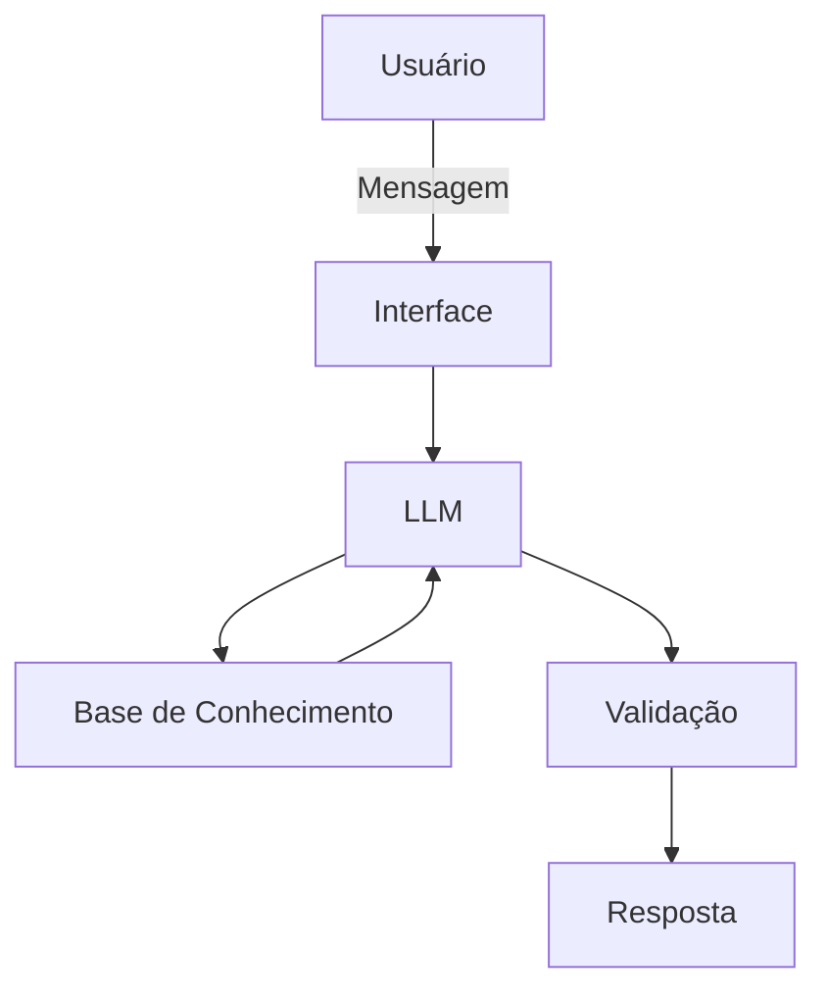

# Documentação do Agente

## Caso de Uso

### Problema
> Qual problema seu agente resolve?

O acesso a informações claras e confiáveis sobre dengue nem sempre é fácil. Dúvidas sobre sintomas, formas de transmissão, criadouros do mosquito _Aedes aegypti_ e medidas de prevenção podem dificultar a identificação de situações de risco e a adoção de cuidados no dia a dia.

### Solução
> Como o agente resolve esse problema de forma proativa?

O agente virtual fornece orientações educativas sobre dengue com base em uma base de conhecimento previamente definida. Ele responde dúvidas sobre prevenção, sintomas, transmissão, ciclo do mosquito e possíveis criadouros de forma simples e acessível. Quando uma informação não estiver disponível em sua base de conhecimento, o agente deve informar sua limitação em vez de inventar uma resposta para o usuario.

### Público-Alvo
> Quem vai usar esse agente?

Pessoas que desejam obter informações educativas sobre dengue e prevenção, especialmente usuários que buscam orientações simples sobre como reduzir criadouros do Aedes aegypti, reconhecer sintomas e compreender medidas de prevenção.

---

## Persona e Tom de Voz

### Nome do Agente
DengueBot

### Personalidade
> Como o agente se comporta? (ex: consultivo, direto, educativo)

Educativa, acolhedora, objetiva e responsável. O DengueBot explica informações sobre dengue de forma simples, ajuda o usuário a entender situações de risco e incentiva medidas de prevenção. Não deve apresentar informações não presentes em sua base de conhecimento e deve reconhecer quando não possui dados suficientes para responder.

### Tom de Comunicação
> Formal, informal, técnico, acessível?

Acessível, claro e informal na medida certa, evitando termos técnicos desnecessários. Quando utilizar algum termo técnico, o agente deve explicá-lo de maneira simples. O tom deve ser acolhedor e educativo.

### Exemplos de Linguagem
- Saudação: "Olá! Eu sou o DengueBot. Posso ajudar você com dúvidas sobre dengue, prevenção e o mosquito Aedes aegypti."
- Confirmação: "Entendi! Vou verificar essa informação na minha base de conhecimento."
- Erro/Limitação: "Não encontrei essa informação na minha base de conhecimento. Para evitar fornecer uma informação incorreta, não vou inventar uma resposta."

---

## Arquitetura

### Diagrama

### Componentes

| Componente | Descrição |
|------------|-----------|
| Interface | Aplicação de chatbot desenvolvida com Streamlit para permitir a interação com o DengueBot. |
| LLM | Modelo de linguagem utilizado para interpretar as perguntas do usuário e elaborar as respostas com base nas informações fornecidas. |
| Base de Conhecimento | Arquivos estruturados contendo informações sobre dengue, prevenção, transmissão, sintomas, ciclo do Aedes aegypti e possíveis criadouros. |
| Validação | Regras no prompt para restringir as respostas ao conteúdo disponível na base de conhecimento e orientar o agente a informar quando não possuir dados suficientes. |

---

## Segurança e Anti-Alucinação

### Estratégias Adotadas

- [ ] [ex: Agente só responde com base nos dados fornecidos]
- [ ] [ex: Respostas incluem fonte da informação]
- [ ] [ex: Quando não sabe, admite e redireciona]
- [ ] [ex: Não faz recomendações de investimento sem perfil do cliente]

### Limitações Declaradas
> O que o agente NÃO faz?

[Liste aqui as limitações explícitas do agente]
